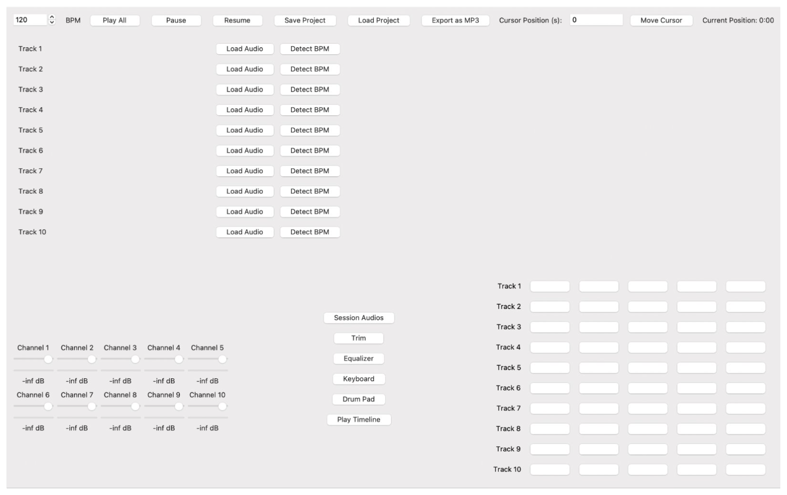

# The Groove Window (Embedded Audio Mixer)

**The Groove Window** is an all-in-one embedded audio controller designed for beginner composers. Built on an STM32 Microcontroller, it enables real-time musical input and control through a velocity-sensitive keyboard, drum pads, equalization knobs, and USB MIDI communication to a software DAW (Digital Audio Workstation).

---

## Project Overview

This repo is a showcase of project architecture, hardware design, software integration, and media demos.

### Key Features:
- 12-key velocity-sensitive piano interface with octave shifting
- 4 responsive drum pads
- 3 equalization knobs for real-time audio manipulation
- USB MIDI integration with Digital Audio Workstation
- Real-time embedded firmware on STM32 Microcontroller using C

---

## System Diagrams

### Block Diagram

### Firmware Flow (Embedded)

---

## Hardware Photos

### Bird’s Eye View

### Internal Layout

### Sensor and Encoder Hardware
#### Hall-Effect Sensor

#### Rotary Encoders

### USB Connectivity

---

## Software Snapshots

### Digital Audio Workstation

---

## Demo Videos

### Piano Input
[piano.mov](demo/piano.mp4)

### Drum Pads
[drum.mov](demo/drum.mp4)

### Equalizer Control
[equalizer.mov](demo/equalizer.mp4)

> You can download or preview these `.mp4` files depending on your browser or GitHub client.
